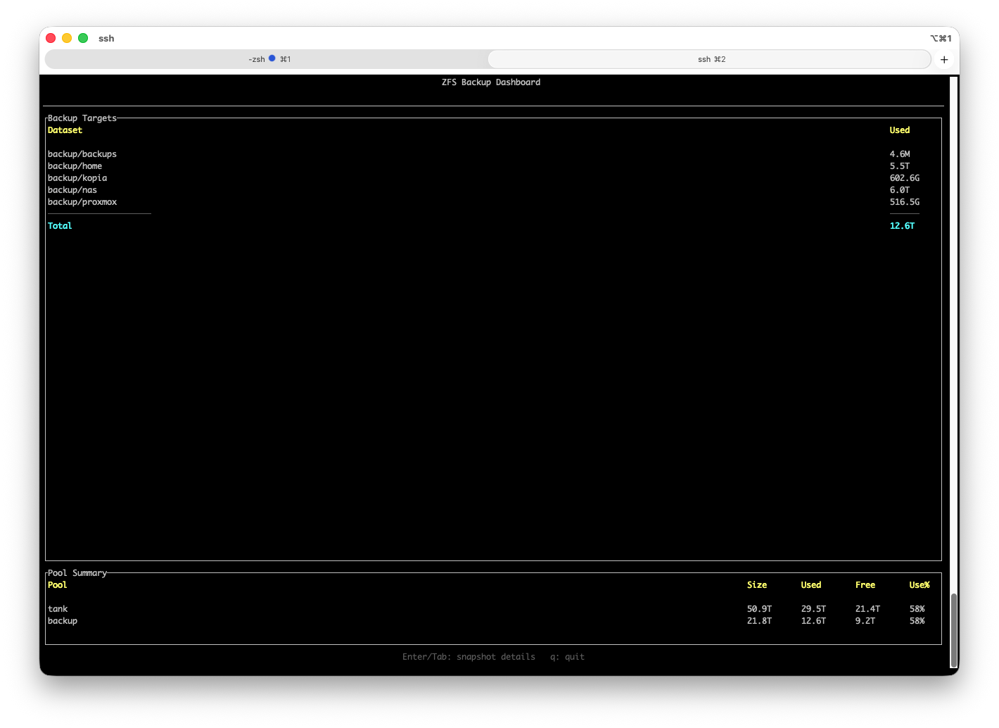
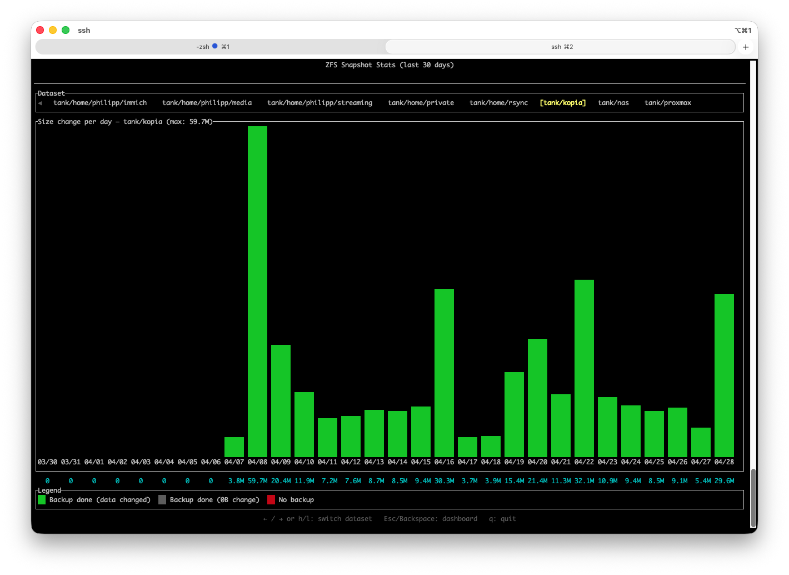

# zfs-snap-stats

A terminal UI tool that visualizes ZFS snapshot statistics over the last 30 days. Shows a backup dashboard with pool summary and daily size changes per dataset with color-coded bars indicating backup status.





## Features

- **Dashboard** with backup target sizes, totals, and pool free space
- Bar chart of daily snapshot size changes per dataset
- Color coding: green (data changed), gray (0B change), red (no backup)
- Horizontal scrolling dataset selector for narrow terminals
- Auto-detects local ZFS or falls back to SSH (`root@192.168.168.137`)
- Bars scale to fill the terminal width

## Build

```
cargo build --release
```

## Usage

```
./target/release/zfs-snap-stats
```

### Controls

| Key | Action |
|-----|--------|
| `Enter` / `Tab` | Open snapshot details (from dashboard) |
| `Esc` / `Backspace` | Back to dashboard |
| `Left` / `h` | Previous dataset |
| `Right` / `l` | Next dataset |
| `q` | Quit |

## Dependencies

- [ratatui](https://github.com/ratatui/ratatui) -- TUI framework
- [crossterm](https://github.com/crossterm-rs/crossterm) -- terminal backend
- [chrono](https://github.com/chronotope/chrono) -- date handling

## Backup Setup Example

The [`examples/`](examples/) directory contains the backup scripts that generate the ZFS snapshots this tool visualizes:

- **backup.sh** -- creates daily snapshots via [zfSnap](https://www.zfsnap.org/) and syncs them to a backup pool
- **sync-zfs-snapshots** -- Python script that incrementally replicates snapshots between ZFS pools (from [phaus/sync-zfs-snapshots](https://github.com/phaus/sync-zfs-snapshots))
- **cleanup.sh** -- removes expired snapshots by TTL marker
- **setup.sh** -- installs zfSnap and sync-zfs-snapshots
- **stats.sh** -- shows pool status and I/O stats

See [`examples/README.md`](examples/README.md) for TTL modifiers and cron setup.
