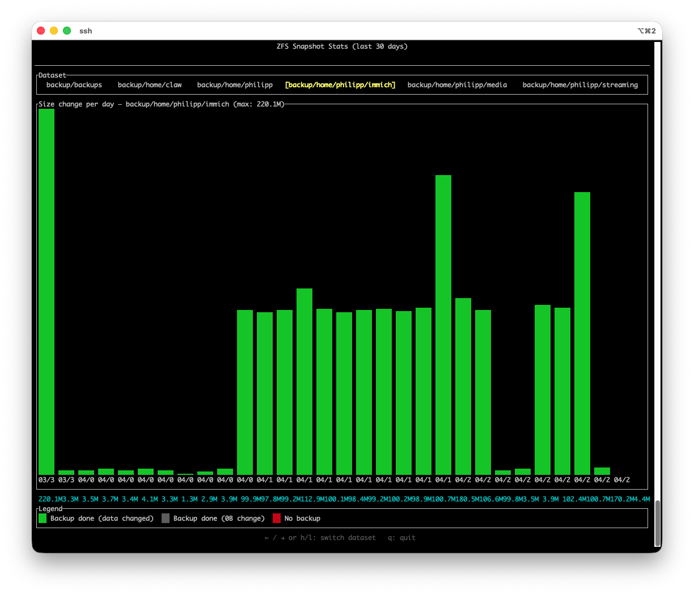

# zfs-snap-stats

A terminal UI tool that visualizes ZFS snapshot statistics over the last 30 days. Shows daily size changes per dataset with color-coded bars indicating backup status.



## Features

- Bar chart of daily snapshot size changes
- Color coding: green (data changed), gray (0B change), red (no backup)
- Switch between ZFS datasets with arrow keys
- Auto-detects local ZFS or falls back to SSH (`root@192.168.168.137`)
- Bars scale to fill the terminal width

## Build

```
cargo build --release
```

## Usage

```
./target/release/zfs-snap-stats
```

### Controls

| Key | Action |
|-----|--------|
| `Left` / `h` | Previous dataset |
| `Right` / `l` | Next dataset |
| `q` / `Esc` | Quit |

## Dependencies

- [ratatui](https://github.com/ratatui/ratatui) -- TUI framework
- [crossterm](https://github.com/crossterm-rs/crossterm) -- terminal backend
- [chrono](https://github.com/chronotope/chrono) -- date handling

## Backup Setup Example

The [`examples/`](examples/) directory contains the backup scripts that generate the ZFS snapshots this tool visualizes. See [`examples/README.md`](examples/README.md) for details.
